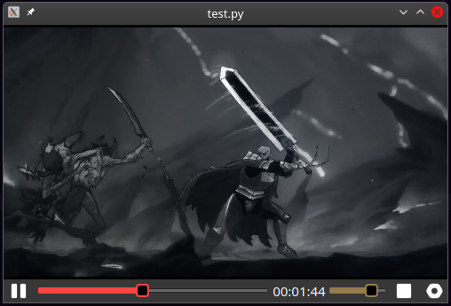

# widget-vlc

widget: video player con vlc para `Pyside6` 

## Librerias
- PySide6            6.9.3

## notas
- agregue el core con vlc
- agregue ui de controles
- agregue test_core para hacer pruebas del core y los controles
- agregue icons
- los labels de tiempo ya cambian
- asigne sus metodos a todos los botones
- el slide de volumen ya funciona
- [ ] obtener la duracion del video (falla:-1)
- position[float]: se muestra como porcentaje de entre 0.0 y 1.0
- he creado metodos para mover la posicion de nuevo para actualizar los labels de tiempo
- el lb_info muestra la duracion y el nombre de la captura
- al mover el slide de posicion se puede recorrer el video
- pymediainfo solo se utiliza para obtener la duracion correcta
- para ya no usar pymediainfo solo para la duracion del mismo vlc con lenght se puede implementar un retraso al llamar a la funcion para que sea correcta la devolusion
- [x] agregar retraso a la funcion length
- ahora cambia el icono de play y pause
- ya obtiene la duracion sin mediainfo (falta limpiar)
- cambie y renombre los iconos en el qrc
- [x] acomodar y limpiar core
- [x] acomodar y limpiar widget
- [x] coherencia en los nombres y documentar
- [x] widget listo para usar como modulo (ya no desde un test)
- la clase controles tiene un metodo stop para
- le coloque estilos a los sliders de tiempo y volumen

## to do
- [ ] bug: al tratar de adelantar durante los primeros segundos no puede adelantar (no se porque ocurre esto si luego funciona normal)
- [ ] probar en windows (por el momento solo lo probe en linux)

